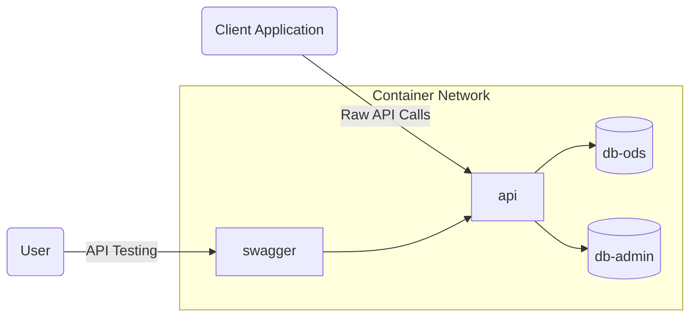
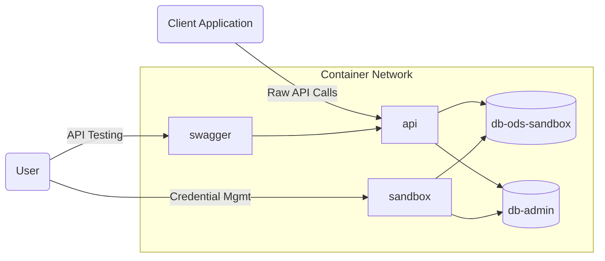

# Docker for the ODS/API Platform

## Overview

This directory contains dockerfiles and related scripts, as needed, for the
official binary release images of the ODS / API platform.

As appropriate, these images are built from the same NuGet packages that are
distributed as the "binary release" of the platform. This source repository also
includes sample Docker Compose files. These are intended for end-to-end and
local testing, not for production deployments.

The [Ed-Fi-ODS-Docker](https://github.com/Ed-Fi-Alliance-OSS/Ed-Fi-ODS-Docker)
repository continues to hold more complex Docker Compose scripts that also
demonstrate loading tools from other repositories, and serve as a starting point
for potential production releases.

## Docker Compose Files

There are three compose files for each database server (PgSql and MsSql) provided for local testing:

1. `docker-compose-hub-{pgsql/mssql}.yml`: loads images that have already been published to
   Docker Hub, running in "single tenant, single year" mode.
2. `docker-compose-sandbox-{pgsql/mssql}.yml`: creates and loads local images from NuGet
   packages, running in "sandbox" mode with both the minimal (descriptors only)
   and populated (descriptors and fake sample data) templates available.
3. `docker-compose-local-{pgsql/mssql}.yml`: creates and loads local images from NuGet
   packages, running in "single tenant, single year" mode
   with only the minimal template database containing pre-loaded descriptors.

> [!WARNING]
> These images are not appropriate for production use!

These compose files expect the presence of a `.env` file. You can copy
`.env.example` and customize it for use with any of the three. The commands
below will use your `.env` file automatically; you can use an alternate file
name if you add an argument like `--env-file {filePath}` to the `docker compose
up` command.

### Credentials for Single Tenant Instance

The "single tenant, single year" (hub and local) compose files do not have any credentials at
startup. The script [bootstrap.ps1](./bootstrap.ps1) creates a set of initial
credentials with access to all resources, using the `Ed-Fi Sandbox` claimset for
convenience.

* Key: `minimalKey`
* Secret: `minimalSecret`.

In a real production environment you would use Admin API or Admin App to create
these credentials, and of course you would want to install a real certificate.

### Targeting Standard and Extension Versions

Before running `docker compose` commands, run `get-versions.ps1`. This script takes the following required parameters
* `StandardVersion`
* `ExtensionVersion`

```shell
# For example to target the 4.0.0 data standard
.\get-versions.ps1 -StandardVersion "4.0.0" -ExtensionVersion 1.1.0
```

### Example Operational Commands

Substitute the correct `docker-compose-*` filename as needed:

```shell
# (optional) Only build the images, don't start them 
docker compose -f docker-compose-local-pgsql.yml build

# Start
docker compose -f docker-compose-local-pgsql.yml up -d

# Stop, but do not remove containers
docker compose -f docker-compose-local-pgsql.yml stop

# Stop and remove containers
docker compose -f docker-compose-local-pgsql.yml down

# Stop and remove containers and volumes
docker compose -f docker-compose-local-pgsql.yml down -v
```

### Single Tenant Instance Network Topology



URL's:

* [Ed-Fi API](http://localhost:8001)
* [Swagger UI](http://localhost:8002)

### Sandbox Network Topology



URL's:

* [Ed-Fi API](http://localhost:8001)
* [Swagger UI](http://localhost:8002)
* [Sandbox Admin](http://localhost:8003)